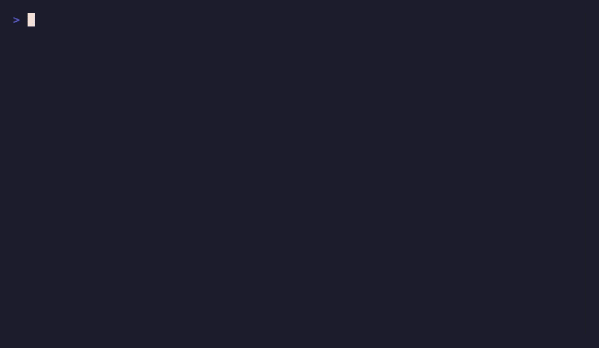

# agent-discipline

> **8 battle-tested discipline skills that stop your AI coding agent from confidently shipping broken code — each with a verifiable done-criterion.**
>
> Andrej Karpathy named the bad habits. This turns the fixes into skills your agent will actually *execute* — and whose results you can *verify*.



**Reproduce it in 20 seconds** — every ✅/❌ above is a real test run, nothing staged:
`bash demo/run-demo.sh` · [what it shows →](demo/)

[](LICENSE)


---

## Why this exists / 为什么做这个

LLM coding agents are fast and confident — which is exactly the problem. They assume an API shape from memory, delete code without checking callers, declare "done" without running anything, and rebuild a design that was deliberate. The failure mode isn't *can't code*; it's *ships plausible-looking wrong code, confidently*.

> 大模型编码 agent 又快又自信——这恰恰是问题所在。它会凭记忆假设 API、不查调用方就删代码、没跑过就说"完成"、把刻意的设计推倒重来。它的失效模式不是"不会写代码",而是"自信地交付看起来对、其实错的代码"。

`agent-discipline` is **8 composable guardrail skills**. Unlike a single fat `CLAUDE.md`, each loads only when its trigger fires (saving context), and each ends with a **verifiable done-criterion** — a concrete ✅/❌/⚠️ check, not vague advice.

> `agent-discipline` 是 **8 条可组合的护栏 skill**。和一坨常驻的 `CLAUDE.md` 不同,每条只在触发条件命中时加载(省 context),且每条都以一条**可验证的完成判据**收尾——一个具体的 ✅/❌/⚠️ 检查点,而不是模糊建议。

## The 8 disciplines / 八条纪律

| Skill | What it enforces | Verifiable check |
|---|---|---|
| [`ask-before-act`](skills/ask-before-act/SKILL.md) | Align on design before changing architecture/behavior. The agent is a general contractor, not the architect. | Was there one explicit confirmation before the change? |
| [`test-is-truth`](skills/test-is-truth/SKILL.md) | "Done" means *verified by a test*, not *code written*. | Is the claim backed by a ✅/❌/⚠️ result? |
| [`log-first`](skills/log-first/SKILL.md) | New code ships with key-path logging (connect, state change, error, request/response). | Are the key paths observable in logs? |
| [`check-versions`](skills/check-versions/SKILL.md) | Check the actual version + docs before using any API. No coding from training-data memory. | Was the version verified before writing? |
| [`incremental-build`](skills/incremental-build/SKILL.md) | Build after *each* file edit; never batch-edit then verify. | Was each file verified before the next? |
| [`no-dead-code`](skills/no-dead-code/SKILL.md) | Grep all callers before deleting any symbol. | Were references searched before deletion? |
| [`first-principles`](skills/first-principles/SKILL.md) | Reason from facts and constraints, not "the usual way". | Is there a *why-this-time*, not just convention? |
| [`agent-team`](skills/agent-team/SKILL.md) | Non-trivial work goes to sub-agents; a QA inspector with veto is mandatory. | Did QA review before "done"? |

## Install / 安装

Agent Skills are portable across tools that support them (Claude Code, Cursor, Codex, Gemini CLI, Windsurf, and more). Drop them into your skills directory:

```bash
git clone https://github.com/yli769227-jpg/agent-discipline.git
cd agent-discipline
./install.sh          # copies the 8 skills into ~/.claude/skills/
```

Or copy a single discipline you want:

```bash
cp -r skills/test-is-truth ~/.claude/skills/
```

> 安装脚本把 8 条 skill 拷进 `~/.claude/skills/`。也可以只挑你想要的某一条拷过去。

## How it works / 原理

Skills use **progressive disclosure**: the agent sees only each skill's name + description until a matching context appears, then loads the full instructions on demand. So you get the discipline *when it matters* without paying the context cost the rest of the time. Each `SKILL.md` is self-contained, and ships an `EXAMPLES.md` with real-world anti-patterns (generalized from actual agent mishaps) — read one to see the shape.

> Skill 用**渐进式加载**:平时 agent 只看到每条 skill 的名字 + 描述,直到匹配场景出现才按需加载完整指令。于是你在**需要时**才拿到纪律约束,其余时间不付 context 成本。每个 `SKILL.md` 自包含,并配一份 `EXAMPLES.md` 真实反例(从真实踩坑脱敏改写)——读一条就懂结构。

## Roadmap / 路线图

- [x] Demo GIF (before/after on a real bug)
- [x] Per-skill `EXAMPLES.md` with real-world anti-patterns
- [ ] Vertical packs (data engineering, frontend, quant) on top of the core 8
- [ ] One-command install for Cursor / Codex / Gemini CLI layouts

## Contributing / 贡献

Got a discipline that saved you from a confident-but-wrong agent? Open an issue with the failure mode + the verifiable check that catches it. PRs that add an `EXAMPLES.md` to an existing skill are especially welcome.

## License

MIT — see [LICENSE](LICENSE).
