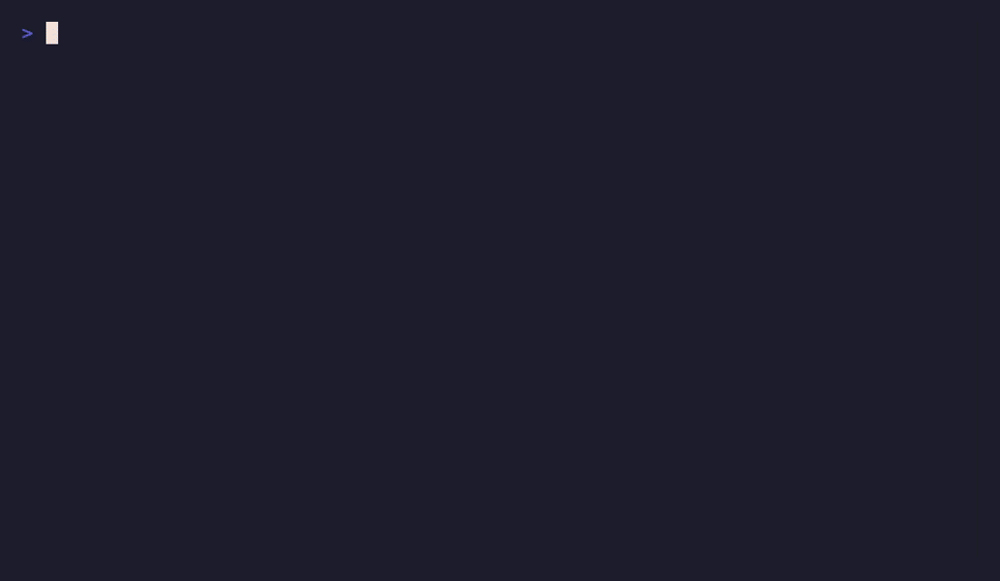

# agent-discipline

> ## "Trust me bro" is not a test result.
>
> **10 battle-tested discipline skills that stop your AI coding agent from confidently shipping broken code — each with a verifiable done-criterion.**
>
> Andrej Karpathy named the bad habits. This turns the fixes into skills your agent will actually *execute* — and whose results you can *verify*.



**Reproduce it in 20 seconds** — every ✅/❌ above is a real test run, nothing staged:
`bash demo/run-demo.sh` · [what it shows →](demo/)

[](LICENSE)


---

## Why this exists / 为什么做这个

LLM coding agents are fast and confident — which is exactly the problem. They assume an API shape from memory, delete code without checking callers, declare "done" without running anything, and rebuild a design that was deliberate. The failure mode isn't *can't code*; it's *ships plausible-looking wrong code, confidently*.

> 大模型编码 agent 又快又自信——这恰恰是问题所在。它会凭记忆假设 API、不查调用方就删代码、没跑过就说"完成"、把刻意的设计推倒重来。它的失效模式不是"不会写代码",而是"自信地交付看起来对、其实错的代码"。

`agent-discipline` is **10 composable guardrail skills**. Unlike a single fat `CLAUDE.md`, each loads only when its trigger fires (saving context), and each ends with a **verifiable done-criterion** — a concrete ✅/❌/⚠️ check, not vague advice.

> `agent-discipline` 是 **10 条可组合的护栏 skill**。和一坨常驻的 `CLAUDE.md` 不同,每条只在触发条件命中时加载(省 context),且每条都以一条**可验证的完成判据**收尾——一个具体的 ✅/❌/⚠️ 检查点,而不是模糊建议。

## The 10 disciplines / 十条纪律

| Skill | What it enforces | Verifiable check |
|---|---|---|
| [`ask-before-act`](skills/ask-before-act/SKILL.md) | Align on design before changing architecture/behavior. The agent is a general contractor, not the architect. | Was there one explicit confirmation before the change? |
| [`test-is-truth`](skills/test-is-truth/SKILL.md) | "Done" means *verified by a test*, not *code written*. | Is the claim backed by a ✅/❌/⚠️ result? |
| [`log-first`](skills/log-first/SKILL.md) | New code ships with key-path logging (connect, state change, error, request/response). | Are the key paths observable in logs? |
| [`check-versions`](skills/check-versions/SKILL.md) | Check the actual version + docs before using any API. No coding from training-data memory. | Was the version verified before writing? |
| [`incremental-build`](skills/incremental-build/SKILL.md) | Build after *each* file edit; never batch-edit then verify. | Was each file verified before the next? |
| [`no-dead-code`](skills/no-dead-code/SKILL.md) | Grep all callers before deleting any symbol. | Were references searched before deletion? |
| [`first-principles`](skills/first-principles/SKILL.md) | Reason from facts and constraints, not "the usual way". | Is there a *why-this-time*, not just convention? |
| [`agent-team`](skills/agent-team/SKILL.md) | Non-trivial work goes to sub-agents; a QA inspector with veto is mandatory. | Did QA review before "done"? |
| [`restraint`](skills/restraint/SKILL.md) | No overproduction: no guards for impossible cases, no speculative flags, no premature abstraction, no trivial dependencies, no swallowed errors. | Does every new param/abstraction/dependency have a present-day caller? |
| [`test-quality`](skills/test-quality/SKILL.md) | Tests themselves must be trustworthy: mock only at system boundaries, never mock state objects, test behavior not implementation. | Is every mock on a nameable system boundary? |

## Install / 安装

**One command, any agent** — via the [skills CLI](https://github.com/vercel-labs/skills) (Claude Code, Cursor, Codex, Copilot, Gemini CLI, and 70+ more):

```bash
npx skills add yli769227-jpg/agent-discipline
```

Pick specific disciplines or targets with `--skill` / `--agent`, or preview with `--list`.

**Claude Code native** — via the built-in plugin marketplace (auto-updates on `/plugin marketplace update`):

```text
/plugin marketplace add yli769227-jpg/agent-discipline
/plugin install agent-discipline@agent-discipline
```

Or clone and use the bundled installer (Claude Code layout):

```bash
git clone https://github.com/yli769227-jpg/agent-discipline.git
cd agent-discipline
./install.sh              # copy the 10 skills into ~/.claude/skills/ (global)
./install.sh --project    # or into ./.claude/skills/ of the current repo (commit & share with the team)
./install.sh --force      # overwrite skills you've already installed
```

Or copy a single discipline you want:

```bash
cp -r skills/test-is-truth ~/.claude/skills/
```

> **推荐一条命令装**:`npx skills add yli769227-jpg/agent-discipline`,通过 skills CLI 支持 Claude Code / Cursor / Codex / Copilot / Gemini CLI 等 70+ 工具,可用 `--skill` / `--agent` 挑条目和目标,`--list` 先预览。
>
> **Claude Code 用户**也可走原生插件市场:`/plugin marketplace add yli769227-jpg/agent-discipline` 后 `/plugin install agent-discipline@agent-discipline`,以后 `/plugin marketplace update` 即可跟仓库自动更新。
>
> 也可 clone 后用仓库自带脚本(Claude Code 布局):默认拷进 `~/.claude/skills/`;加 `--project` 装进当前仓库的 `./.claude/skills/`(可随仓库提交、团队共享),加 `--force` 覆盖已装的。或者只挑某一条手动拷过去。
>
> **命名 / Naming:** skill 名即目录名(`test-is-truth`、`log-first` …),触发时用的就是这个名字。若你早期手动装过 `discipline-` 前缀的旧版,删掉旧的再重装以对齐。

## How it works / 原理

Skills use **progressive disclosure**: the agent sees only each skill's name + description until a matching context appears, then loads the full instructions on demand. So you get the discipline *when it matters* without paying the context cost the rest of the time. Each `SKILL.md` is self-contained, and ships an `EXAMPLES.md` with real-world anti-patterns (generalized from actual agent mishaps) — read one to see the shape.

> Skill 用**渐进式加载**:平时 agent 只看到每条 skill 的名字 + 描述,直到匹配场景出现才按需加载完整指令。于是你在**需要时**才拿到纪律约束,其余时间不付 context 成本。每个 `SKILL.md` 自包含,并配一份 `EXAMPLES.md` 真实反例(从真实踩坑脱敏改写)——读一条就懂结构。

## When NOT to use this / 何时无效

Honest limits — this is not a magic wand:

- **Trivial fixes get slower, not safer.** A one-character typo or an import fix doesn't need `ask-before-act` + QA review. The disciplines target *non-trivial* changes; several skills carry explicit "when NOT to trigger" carve-outs for exactly this.
- **The descriptions are always in context.** Progressive disclosure means full instructions load on demand, but the 10 names + descriptions do sit in your agent's context permanently (~1–2k tokens). If you only ever hit one failure mode, install just that skill.
- **Discipline ≠ correctness.** These skills force the agent to *check* — they don't make the checks smart. A green test on a bad assertion still lies (that's why `test-quality` exists, but it can't catch everything either).
- **No substitute for human review.** `ask-before-act` routes design decisions to you; if you rubber-stamp every prompt, the guardrail is theater.

> 诚实边界——这不是魔法棒:单字符 typo / import 修复走流程只会更慢,纪律只针对非平凡变更(多条 skill 内置了"不触发"豁免);10 条 name+description 常驻 context(约 1–2k token),只踩一种坑就只装那一条;纪律强制 agent 去"检查",但不保证检查本身聪明——烂断言跑绿了照样骗人;`ask-before-act` 把设计决策交还给你,你若无脑放行,护栏就是演戏。

## Roadmap / 路线图

- [x] Demo GIF (before/after on a real bug)
- [x] Per-skill `EXAMPLES.md` with real-world anti-patterns (all 10)
- [x] One-command install for Cursor / Codex / Gemini CLI — via [`npx skills add`](https://github.com/vercel-labs/skills)
- [x] Claude Code plugin marketplace support (`/plugin marketplace add yli769227-jpg/agent-discipline`)
- [ ] Vertical packs (data engineering, frontend, quant) on top of the core 10

## Contributing / 贡献

Got a discipline that saved you from a confident-but-wrong agent? Open an issue with the failure mode + the verifiable check that catches it. PRs that add an `EXAMPLES.md` to an existing skill are especially welcome.

## License

MIT — see [LICENSE](LICENSE).
